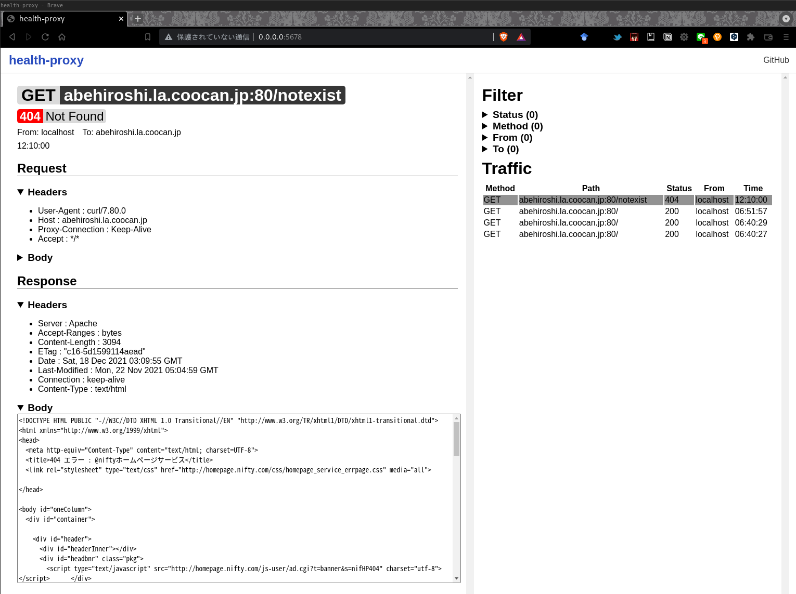

# Health Proxy




A simple proxy to check the traffic of each container in a microservice architecture.

## Status

Under development in develop branch

## Overview

Read the HTTP communication between containers and monitor if any 5xx error occurs.

## Dependencies

- nkf

## Run

### Build

```sh
nimble build  # build proxy server

# build front
cd front
elm make src/Main.elm --output=dist/static/js/elm.js --optimize
```

### Up

```sh
./health_proxy <address> <proxy_port> <webconsole_port>
```
